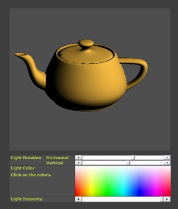

## Illumination in 3D

### Description

Explains implementation of light vector to illuminate 3D objects for smooth shading.
 
### More Info
 
DirecX8

One should have understanding of 3D graphics programming.

             |
---                |---
**Submitted On**   |2009-10-06 05:50:02
**By**             |[vbinterface](https://github.com/Planet-Source-Code/PSCIndex/blob/master/ByAuthor/vbinterface.md)
**Level**          |Intermediate
**User Rating**    |5.0 (15 globes from 3 users)
**Compatibility**  |VB 6\.0
**Category**       |[Graphics](https://github.com/Planet-Source-Code/PSCIndex/blob/master/ByCategory/graphics__1-46.md)
**World**          |[Visual Basic](https://github.com/Planet-Source-Code/PSCIndex/blob/master/ByWorld/visual-basic.md)
**Archive File**   |[Illuminati2164421062009\.zip](https://github.com/Planet-Source-Code/vbinterface-illumination-in-3d__1-72519/archive/master.zip)

### API Declarations

GetPixel, SetPixel

